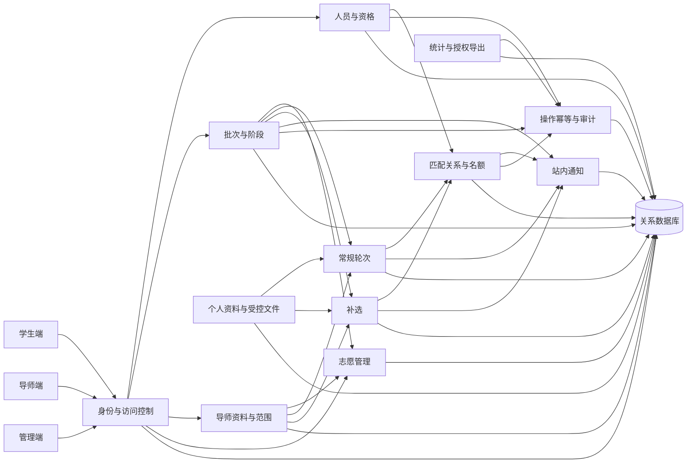

# 师生互选系统功能模块设计

> 版本：0.5（已确认的功能基线）  
> 状态：业务方已确认模块职责、用户故事覆盖与核心协作边界；管理员业务能力授权规则与 API 契约已定案，模块可进入实现。  
> 更新日期：2026-10-03  
> 基线：[总体需求](../requirements.md) 0.20、[业务规则](business-rules.md) 0.12、[状态机](state-machine.md) 0.11、[权限矩阵](permission-matrix.md) 1.0、[用户故事](user-stories.md) 1.0、[数据库设计](database-design.md) 0.5、[API 设计](api-design.md) 0.4。

## 1. 设计边界

系统按首期已确认范围划分业务模块，建议采用 Java 8 / Spring Boot 2.6.6 下的模块化单体结构，以 MySQL/InnoDB 作为共享关系数据库。模块边界按业务职责、数据归属和事务边界划分；同一部署单元共享数据库事务，不引入首期未确认的微服务、消息队列或自动匹配算法。

模块只表达已确认业务。学生、导师、管理员三类角色和管理员授权范围由服务端统一校验；总管理员额外负责管理员账号管理及为其他 ADMIN 账号授予、撤销普通业务能力。`ADMIN_ACCOUNT_MANAGER` 仅能在系统初始化时设置，或按应急恢复流程调整，常规接口不可授予、转移或撤销。页面隐藏功能不能代替服务端的对象、字段、时间和状态校验。

本设计是总体功能结构，不构成 API/错误码规范或页面字段定案。物理表名见[数据库设计](database-design.md)，数据字段边界见[权限矩阵](permission-matrix.md)，状态变更以[状态机设计](state-machine.md)为准。TODO-49 暂缓事项不纳入本期模块功能。

## 2. 模块总览与数据归属

| 模块 | 主要职责 | 主要持有数据 | 主要调用方/协作 |
|---|---|---|---|
| 账号与访问控制 | 登录、账号启停、临时凭证、强制改密、角色/范围授权、管理员账户和业务能力授权管理 | `account`, `account_authorization`, `temporary_credential` | 所有模块调用权限服务；人员模块创建学生/导师账户；授权变更写审计且提交后即时生效。 |
| 人员、资格与目录 | 学生/导师人员信息、专业目录、年度资格、名单导入、学生身份分类版本与更正申请 | `student`, `teacher`, `major`, `annual_eligibility`, `student_classification_revision`, `student_identity_correction_request`, `personnel_import*` | 批次、志愿和申请模块查询资格/专业；填报后身份纠错协调匹配关系与申请状态。 |
| 批次与阶段管理 | 批次配置、发布、启动、暂停/恢复、取消、归档、阶段排期与冻结名单 | `selection_batch`, `batch_rule_snapshot`, `batch_stage`, `schedule_revision`, `batch_lifecycle_event`, `batch_student`, `batch_running_slot` | 调用资格、导师范围、名额和申请模块准备/关闭阶段；提供批次状态门禁。 |
| 导师资料与可报范围 | 导师公开资料版本审核、批次可报学位类型/专业设置及填报开始冻结 | `teacher_public_profile_version`, `teacher_application_scope_version`, `teacher_application_scope_slot`, `teacher_allowed_major` | 学生目录按本人分类计算“是否可填报”；志愿/补选与录取再次校验冻结范围。 |
| 个人资料与受控文件 | 学生资料版本、简历上传/下载授权、附件留存；导师公开资料附件如有 | `student_profile_version`, `managed_file` | 申请模块读取允许字段并固定附件版本；所有文件访问均写敏感访问记录。 |
| 志愿管理 | 身份核对、志愿版本提交/修改/撤回、截止锁定和历史查看 | `preference_submission`, `preference_item`, `batch_student` 中的志愿状态/指针 | 调用权限、批次、资格、范围与文件/资料服务；常规轮次只消费最终锁定版本。 |
| 常规轮次办理 | 当前轮队列、逐项录取/不录取、批量办理、自动结案、按规则重开 | `round_application`, `application_event`, `application_profile_snapshot`, `bulk_operation_item` | 进入办理时制作限定字段快照；录取委托匹配与名额模块；阶段模块提供当前轮状态/时间门禁；通知模块发送结果。 |
| 补选办理 | 补选窗口和导师许可、学生单导师申请、导师逐项处理、窗口关闭结案 | `supplement_window`, `supplement_teacher`, `supplement_application`, `student_pending_supplement_slot`, `application_profile_snapshot` | 提交时制作限定字段快照；委托权限/资格/范围检查及匹配名额；关闭窗口时通知批次模块完成批次。 |
| 匹配关系与名额 | 锁定关系、占用名额、撤销/恢复/改派、名额调整和关系纠错 | `matching_relation`, `student_year_match_slot`, `batch_teacher_quota`, `quota_ledger`, `relation_adjustment`, `student_match_event` | 常规、补选和身份纠错写操作的唯一入口；与业务操作、审计、通知事务协作。 |
| 通知与公告 | 站内公告、业务结果通知、收件状态和投递失败重试 | `site_notice`, `notice_recipient`, `delivery_attempt` | 由批次、申请、关系等模块生成；遵守各阶段结果披露时点，不向系统外公示。 |
| 统计、查询与导出 | 学生/导师/管理员结果查询、名额统计、冻结分母统计、授权导出 | 以批次、申请、关系、事件和名额数据派生；`data_access_record` 留导出/敏感访问 | 仅读为主；导出前额外检查授权与字段白名单，文件进入受控文件管理。 |
| 操作幂等与审计 | 业务请求登记、幂等处理、审计事件、敏感数据访问日志 | `business_operation`, `audit_event`, `data_access_record` | 关键写操作统一使用；不承载业务规则判定。 |

模块划分不要求一模块一个部署服务。控制器负责入口参数和身份上下文传递；服务层负责业务校验、权限/对象范围判断及事务编排；Mapper 负责数据读写和执行条件更新、`SELECT ... FOR UPDATE` 等并发 SQL；InnoDB 的行锁、外键和唯一键落实数据库层保护。跨模块的录取、关系调整等核心事务由单个应用服务协调，在同一数据源的一次数据库事务中提交相关记录。强业务引用由数据库外键兜底，Service 仍负责业务校验；不以 Java `synchronized` 或事务外“先查再写”代替数据库并发控制。Entity 不作为接口响应。



## 3. 按角色组织的功能清单

### 3.1 学生端

1. **账号与本人信息：** 登录、首次设置个人密码、查看本人资格/专业/学位类型；维护授权的简介、联系方式和 PDF 简历（单文件不超过 10MB）；提交专业/学位信息更正申请。学生不能直接写身份分类。
2. **导师目录：** 浏览获准公开的导师资料，按研究方向、姓名/工号和本人“是否可填报”筛选；展示导师允许的学位类型/专业，不显示具体剩余名额。可报判断须同时比较学生类型和专业。
3. **身份核对与志愿：** 提交志愿前确认当前专业/学位分类版本；提交 1–3 位不同导师的有序版本；填报截止前可修改或撤回；查看自己的全部志愿版本和锁定状态。
4. **进度和结果：** 查看本人当前轮、匹配状态与已匹配导师；轮次关闭前只展示本轮待处理/已处理，轮次结束后按规则公布该轮结果；未提交、时间跳过和志愿耗尽等原因按权限呈现。
5. **补选与通知：** 仅在管理员预先配置的窗口内，当前为 `UNMATCHED` 时申请一位合格且获准参加补选的导师；同一时刻最多一条待处理申请；查看本人站内通知。

### 3.2 导师端

1. **个人资料：** 编辑本人获准维护的公开资料，查看审核/发布状态；未经审核的新稿不进入学生目录。
2. **批次范围设置：** 为本人批次配置允许学位类型和专业；无需管理员审核；配置不完整按两类学位及全部专业默认全选；填报开始冻结后只读。此范围与名额分开管理。
3. **申请处理：** 只查看当前轮投向本人、当前仍可处理的学生申请及必要资料；填报期看不到志愿，处理某一顺位时看不到学生其他志愿；可逐项录取/不录取，不对学生排序。
4. **批量办理：** 可批量选择当前待处理申请；系统按最终锁定志愿提交时间升序、同一时间按学号升序处理，并返回逐项成功/失败结果；名额不足余项按已确认规则结案。
5. **名额和结果：** 查看本人批次名额、剩余名额、锁定关系及本人统计；不得修改名额或撤销关系。简历仅由受控接口在线查看，导师导出不包含简历和联系方式。
6. **站内联系：** 向当前批次中投给本人的申请学生发送站内消息；接收范围由服务端从当前授权数据生成。

### 3.3 管理端

1. **人员和账号：** 创建/停用/重置学生与导师账号，导入 Excel/CSV 名单，管理资格、专业目录和导师资料；逐行显示重复、缺失或格式错误并留存导入任务。
2. **身份纠错：** 根据学校信息维护学生专业/学位分类；处理学生更正申请；记录变更前后值、依据、人员、时间及受影响业务；填报开始后的处置按已确认规则联动关系、名额和常规申请。
3. **批次设置：** 创建批次，配置适用范围、时间、志愿规则快照、阶段和名额；发布前预览与校验；发布占用同学年运行批次槽位；手动启动、暂停、恢复、取消、归档或按条件解除归档。
4. **导师配置：** 查询导师批次范围和公开资料审核；设置/调整名额但不得低于已锁定数；配置补选参加导师；范围修改遵守填报开始冻结规则。
5. **阶段运行：** 查看三轮进度和待处理量；按规定延期或重开常规轮次；补选必须发布前决定并配时间；窗口关闭自动结案并完成批次。
6. **关系例外：** 授权范围内撤销、恢复或改派关系，填写原因并核验学生状态、名额、批次归档状态；操作须原子更新关系、名额和匹配状态，保留历史并通知相关人员。
7. **统计与审计：** 查看冻结统计分母、当前未匹配总人数、正常志愿流程未匹配、补选和名额使用统计；按额外授权导出限定字段；查询关键业务操作、关系变更和敏感数据访问日志。分母为填报窗口开放时冻结的合格名单（含未提交者、排除同学年已有有效关系者）；正常志愿流程未匹配只计 `ROUND3_EXHAUSTED` 与 `PREFERENCE_EXHAUSTED`，未提交、全部志愿被时间跳过、关系/身份纠错、批次取消分别统计；补选结果单列，取消批次不纳入正常完成率。
8. **管理员账户与授权：** 只有总管理员可创建/重置管理员账号，以及为其他 ADMIN 账号授予或撤销普通业务能力；每项业务授权须限定学院、可选批次范围并保留依据和完整审计。此权限不扩大总管理员自身业务范围。`ADMIN_ACCOUNT_MANAGER` 仅通过系统初始化或 TODO-24 应急恢复流程设置。

### 3.4 用户故事与模块覆盖

下表中的“主责模块”负责实现该场景的业务规则与状态变更；协作模块提供资格、范围、授权或数据能力。跨模块协作必须通过应用服务完成，不能由页面或 Mapper 绕过主责模块直接改写业务状态。

| 用户故事 | 主责模块与协作模块 | 功能验收边界 |
|---|---|---|
| `US-STU-01` 查看导师 | 导师资料与可报范围、账号与访问控制、人员与资格 | 目录只展示已审核公开资料；是否可填报结合当前学生专业、学位类型、批次窗口和导师范围计算，不展示具体剩余名额。 |
| `US-STU-02` 提交有序志愿 | 志愿管理；协作批次阶段、人员分类、可报范围、个人资料 | 先确认身份分类版本；提交 1–3 位不同导师；逐项校验冻结范围；截止前可改/撤回，截止后锁定最后有效版本。 |
| `US-STU-03` 查看每轮进度 | 常规轮次、匹配关系与名额、通知与公告 | 当前轮关闭前只显示待处理/已处理；轮次关闭后按规则披露结果；本人始终可见当前匹配状态。 |
| `US-STU-04` 参加补选 | 补选办理；协作批次阶段、人员分类、可报范围、匹配关系与名额 | 仅 `UNMATCHED` 且符合冻结范围者可申请；同一时刻最多一条待处理申请；补选不重跑常规轮次。 |
| `US-STU-05` 维护资料和简历 | 个人资料与受控文件；协作账号与访问控制、操作幂等与审计 | 只允许维护授权字段；简历为 PDF、单文件不超过 10 MB；查看、下载和保留遵守授权与留存规则。 |
| `US-TCH-01` 维护公开资料 | 导师资料与可报范围；协作个人资料与受控文件、操作幂等与审计 | 导师可编辑本人资料；未审核版本不进入学生目录，范围配置与资料审核分开处理。 |
| `US-TCH-02` 查看并处理当前轮申请 | 常规轮次；协作账号与访问控制、个人资料与受控文件、通知 | 只返回当前轮投向该导师的申请和授权字段；不泄露学生其他志愿或联系方式、成绩。 |
| `US-TCH-03` 在名额内录取 | 常规轮次或补选办理；匹配关系与名额、操作幂等与审计 | 每次录取重新校验学生状态、冻结范围和剩余名额；关系锁定、名额占用、申请结论及历史在同一事务内一致。 |
| `US-TCH-04` 查看结果和名额 | 统计、查询与导出；协作匹配关系与名额、账号与访问控制 | 导师只能查看本人名下结果和名额统计；不允许借查询入口修改名额或关系。 |
| `US-TCH-05` 设置本批次可报范围 | 导师资料与可报范围；协作批次与阶段管理、人员与资格 | 导师自行设置类型和专业，无需管理员审核；配置不完整时按规则默认全选；填报开始冻结，之后常规轮次及补选复用冻结版本。 |
| `US-ADM-01` 创建账号并维护人员 | 账号与访问控制、人员与资格；协作人员导入、操作幂等与审计 | 管理员按授权范围维护学生/导师账号与人员资料；管理员账号的创建/重置仅总管理员可执行。导入须能定位逐行结果。 |
| `US-ADM-07` 管理员业务能力授权 | 账号与访问控制、操作幂等与审计 | 仅总管理员可向其他 ADMIN 账号授予/撤销普通业务能力；学院及可选批次范围必填校验，依据与操作人/时间留痕；不得经常规 API 变更 `ADMIN_ACCOUNT_MANAGER`。 |
| `US-ADM-02` 配置并发布批次 | 批次与阶段管理；协作人员与资格、导师资料与范围、匹配关系与名额、操作幂等与审计 | 发布前完成必需配置与规则校验；发布时占用同学院同学年批次槽位；填报开放时冻结合格学生名单和统计分母。 |
| `US-ADM-03` 监控常规轮次 | 批次与阶段管理、常规轮次；协作统计、查询与导出 | 管理端能区分轮次状态、待处理量、自动结案和跳过原因；延期、暂停、恢复、重开遵循状态机条件并留痕。 |
| `US-ADM-04` 管理补选 | 补选办理、批次与阶段管理；协作导师范围、匹配关系与名额、通知 | 是否安排补选须在发布前决定并配置时间；窗口关闭结案待处理申请并完成批次，关闭后不重开。 |
| `US-ADM-05` 处理例外并审计 | 匹配关系与名额、操作幂等与审计；协作人员与资格、批次与阶段管理、通知 | 关系撤销/恢复/改派须校验操作者范围和批次状态，在同一事务维护关系、名额和学生状态，并保留原因及前后关系。 |
| `US-ADM-06` 查看统计和导出 | 统计、查询与导出；协作数据访问审计、账号与访问控制 | 统计使用冻结分母，分别呈现当前未匹配总数、正常志愿未匹配、身份纠错、补选和名额使用；导出按授权限制字段与范围并留痕。 |

用户故事中的权限、状态、专业/学位范围和并发验收由各场景的主责模块共同落实；访问控制模块提供授权上下文，但领域服务必须再次校验目标对象与当前业务状态。接口路径、字段、响应和错误码见 [API 设计](api-design.md) 0.4。

## 4. 核心用例与模块协作

### 4.1 创建、发布和启动批次

批次管理模块创建草稿，人员/资格模块提供参与名单依据，导师范围/名额模块提供导师配置，批次管理生成规则快照和阶段安排。发布时统一校验必填配置、补选计划/时间和年度唯一性，并占用运行槽位。填报窗口开启时冻结合格学生名单与分母，启动按当前时间落入相应阶段；错过阶段按已确认规则记录跳过结果。

### 4.2 提交并锁定志愿

志愿服务检查当前账号和本人范围、批次/填报窗口、资格、身份分类版本确认、1–3 项完整顺序、导师重复，以及每位导师冻结的学位类型和专业范围。全部通过后以一个事务写志愿版本、志愿项、当前指针和业务操作/审计记录。截止动作锁定最终有效版本；撤回或截止竞争由并发版本/状态条件解决。

### 4.3 常规轮次录取

阶段服务建立本轮队列，只取最终锁定版本中与当前轮序号相同的志愿项。进入处理时申请服务保存限定字段资料快照。导师逐项处理；匹配服务重新检查状态、批次阶段、当前身份、冻结范围、同学年唯一关系和名额。录取事务共同写申请结果、LOCKED 关系、名额占用、学生批次状态、事件/操作/审计及站内通知。拒绝、超时、名额不足、时间跳过和身份纠错跳过分别编码。

### 4.4 补选

批次配置模块保证补选计划在发布前确定。窗口开放后，申请服务检查 `UNMATCHED`、无同学年关系、单条待处理槽位、导师补选许可、冻结范围和剩余名额；提交时保存申请资料快照但不预占名额。导师录取走统一匹配事务。窗口关闭后批量结案待处理申请并将批次设为 `COMPLETED`，不得重开。

### 4.5 身份纠错和关系调整

人员服务创建新的身份分类版本并通知批次/匹配服务检查相关记录。填报开始后，若按已确认规则需要撤销已建立关系，匹配服务在一个事务中撤销关系、释放名额、写入学生状态原因、关系调整、名额流水、业务操作/审计和通知；剩余常规申请按身份纠错跳过。普通关系撤销/恢复/改派通过同一关系服务执行，避免不同功能入口各自修改名额或状态。

## 5. 权限与数据边界

权限服务从登录账号、角色、学院/批次授权、账号状态和当前业务对象构造授权上下文。各领域服务在写入和敏感读取时重新校验，不接受客户端提交的学生 ID、导师 ID 或字段集合作为授权依据。

| 场景 | 服务端强制边界 |
|---|---|
| 学生本人数据 | 只访问本人资料、志愿、申请和结果；专业/学位只读；更正走申请。 |
| 导师申请 | 仅当前批次真实投向该导师的申请；只读姓名、学号、专业、学位、简介、简历；不得读取联系方式、成绩及其他志愿。 |
| 管理员 | 账号能力、学院/批次范围与任务权限三者同时通过；关系纠错、敏感字段访问和导出单独留痕。 |
| 简历和导出文件 | 文件访问逐次检查对象/字段授权，不发免鉴权公开链接；导出限字段和范围并记录访问。 |
| 阶段结果披露 | 学生在轮次关闭前仅看到待处理/已处理；站内通知不得提前泄露导师决定；导师不查询其他导师最终结果。 |
| 总管理员 | 额外可管理管理员账号，并可为其他 ADMIN 账号授予/撤销普通业务能力；其余业务动作沿用自身普通管理员范围校验。不得通过常规 API 变更 `ADMIN_ACCOUNT_MANAGER`。 |

## 6. 服务端分层建议

遵循项目已有包职责，在每个领域下组织实现，而不是把业务逻辑放进控制器或 Mapper：

```text
controller/       请求接入、参数校验、权限入口、调用应用服务
service/          领域规则与应用服务接口
service/impl/     事务编排、状态/范围校验、并发控制
mapper/           数据访问与条件更新，不承载业务规则
entity/           持久化对象
request/          输入结构
response/         输出结构
dto/              模块间服务数据
vo/               角色化查询视图
config/           应用配置
security/         身份认证、授权上下文
common/            Result、分页、通用响应
exception/        业务异常与错误码映射
enums/             稳定状态/类型编码
utils/              无业务决策的通用工具
```

应用层服务是模块调用入口。Controller 不直接返回 Entity；Mapper 不绕过 Service 给其他模块调用。录取、关系调整、批次发布等高风险写事务由单一应用服务编排。通知投递失败通过重试记录处理，不回滚已成功的匹配关系。

## 7. 首期边界与后续文档

首期不包括自动导师/学生分配算法、自动排序推荐、重复执行三轮、系统外结果公示、申诉、原生移动端和深度外部系统集成。导师可逐项选择录取或不录取；批量处理只是按已确认稳定顺序执行，不代表匹配算法。

API 请求/响应、错误码、认证、幂等及并发语义见已定案的 [API 设计](api-design.md)。页面字段与操作说明按本模块、权限矩阵和 API 契约实施。部署、MySQL 5.7.36 服务端核对、文件存储、备份恢复和运维策略按学校环境落实；这些部署检查不改变当前模块和数据设计基线，若环境不兼容则走正式设计变更。
