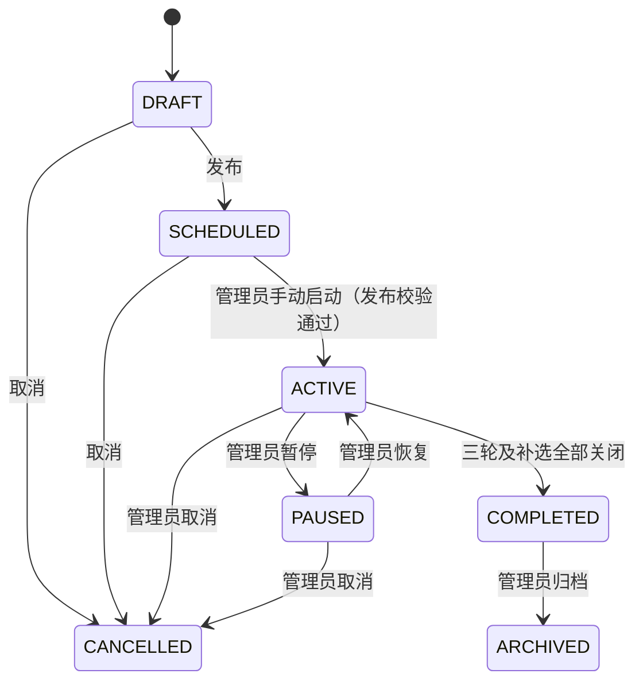
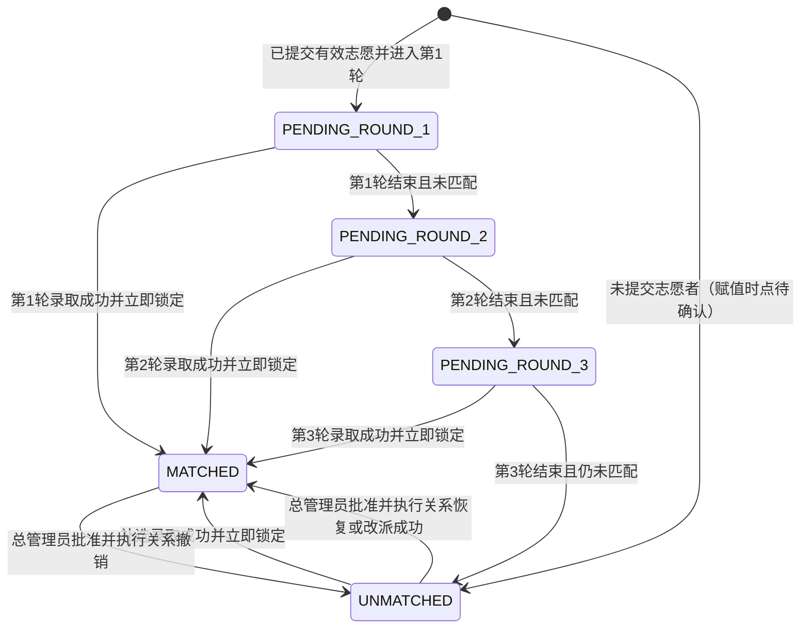
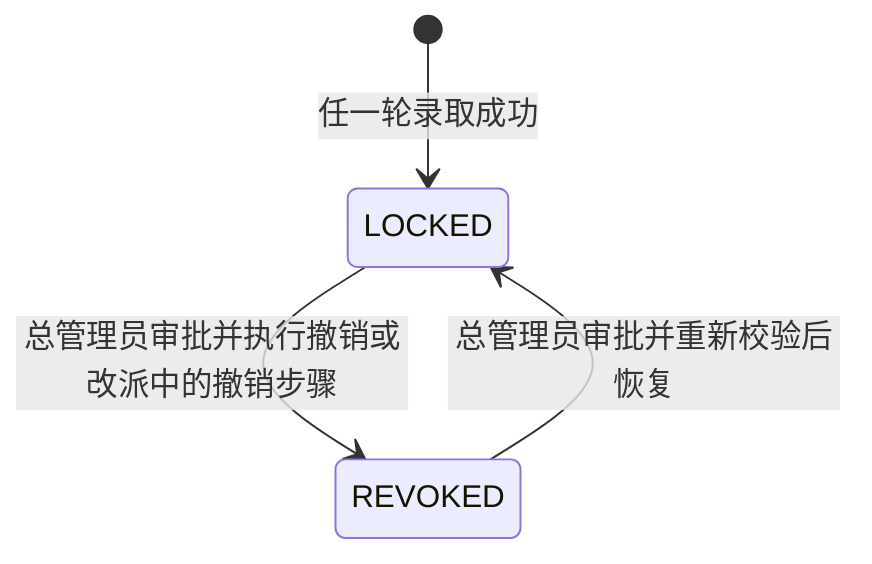

# 状态机设计

> 版本：0.2（详细设计草案）  
> 本文区分批次、轮次、学生志愿、学生匹配状态和锁定关系，避免用单一“申请状态”承载不同含义。业务未明确之处以 `TODO` 标出。

## 1. 状态对象

1. **批次状态**描述整场互选的生命周期。
2. **阶段/轮次状态**描述填报、第 1/2/3 轮及补选各自的开放进度。
3. **学生志愿状态**描述有序志愿是否已提交、是否锁定。
4. **学生匹配状态**描述学生是否等待某一轮、已匹配或三轮后未匹配。
5. **导师对学生的本轮处理状态**描述逐项录取或不录取等当前轮动作。
6. **师生关系状态**描述录取成功后立即锁定的关系及受控的例外处理。

## 2. 批次状态

### 2.1 状态定义

| 状态 | 含义 |
|---|---|
| `DRAFT` 草稿 | 管理员配置批次，尚未对参与者开放 |
| `SCHEDULED` 已发布待开始 | 已发布，开始时间尚未到或尚未执行开始动作 |
| `ACTIVE` 进行中 | 管理员已手动启动；当前处于等待填报、志愿填报、常规轮次或补选阶段 |
| `PAUSED` 已暂停 | 管理员暂时阻止学生和教师办理；当前阶段计时停止，恢复后按剩余时长顺延；已提交志愿、申请和已锁定关系保留 |
| `COMPLETED` 已完成 | 常规三轮及已开启的补选均已结束，批次不再接受互选办理 |
| `ARCHIVED` 已归档 | 只读保存历史结果 |
| `CANCELLED` 已取消 | 管理员取消批次；停止后续流程并保留所有历史数据与操作记录。已生效并锁定的关系继续保留；待处理或处理中的申请转为 `CANCELLED_BY_BATCH`；不物理删除 |

### 2.2 转换

- `DRAFT → SCHEDULED` 需要批次规则和必需数据满足发布校验。

- `ACTIVE` 覆盖填报和多个处理阶段；当前所在阶段由独立阶段状态描述。

- 批次仅可由管理员手动启动；仅已发布且通过发布校验的 `SCHEDULED` 批次可启动。启动后批次变为 `ACTIVE`。启动时已错过部分或全部配置窗口的处理见 TODO-BR-16。
- 启动时若当前时间处于已配置的阶段窗口，直接进入该阶段；若早于志愿填报开始时间，批次保持 `ACTIVE`，阶段状态为 `WAITING_FILLING`。后续阶段按配置时间自动切换。

- 暂停时禁止学生和教师继续办理，当前阶段计时冻结；恢复后按剩余时长顺延。已提交志愿、申请和已锁定关系保留。

- 暂停后到达的新业务请求直接拒绝；暂停前已成功提交的事务继续有效，正在执行的操作以服务端事务最终提交结果为准。

- 取消后停止后续流程并保留历史数据和操作记录；不得物理删除。

- 批次取消后停止后续阶段并保留历史记录。已经生效并锁定的关系不自动撤销，关系继续保留并标注来源批次已取消；如确需撤销，按第 7 节的总管理员例外处理规则执行。
- 批次取消时，所有仍处于待处理或处理中的普通轮次申请及补选申请统一转为 `CANCELLED_BY_BATCH`。
- **TODO：** 批次取消且申请转为 `CANCELLED_BY_BATCH` 后，相关学生的全局匹配状态如何表示；当前状态模型没有批次取消专用的学生匹配状态。
- 普通轮次按时关闭时，未处理申请按不录取处理；补选结束时仍未匹配者保持 `UNMATCHED`。
- 补选只有在管理员开启后才有开放窗口；开放时由管理员设置起止时间，达到结束时间后补选关闭。
- **TODO：** 从未开启补选的批次是否视为补选已关闭，以及何时可进入 `COMPLETED`；补选结束时仍待处理的申请如何结案。

## 3. 阶段与轮次状态

### 3.1 常规阶段

填报期和三轮处理期属于同一批次的不同阶段。建议每个阶段独立记录 `NOT_STARTED`、`WAITING_FILLING`、`OPEN`、`CLOSED`，处理中的轮次还可显示 `PROCESSING`。阶段按管理员设定的时间自动切换；这些状态名是设计用语，最终命名可在后续技术设计统一。批次已启动但尚未进入填报窗口时，填报阶段状态为 WAITING_FILLING。

| 阶段 | 可开放的前置条件 | 处理范围 | 关闭后的作用 |
|---|---|---|---|
| 志愿填报 | 批次已发布且在填报窗口 | 学生提交 1–3 个有序志愿 | 志愿按确认规则锁定，生成第 1 轮候选 |
| 第 1 轮 | 志愿截止，批次未暂停 | 只处理第一志愿且未匹配的学生 | 未匹配者进入第二志愿轮次 |
| 第 2 轮 | 第 1 轮关闭 | 只处理第二志愿且仍未匹配的学生 | 未匹配者进入第三志愿轮次 |
| 第 3 轮 | 第 2 轮关闭 | 只处理第三志愿且仍未匹配的学生 | 尚未匹配者变为 `UNMATCHED` |
| 补选 | 管理员设置起止时间并开启 | 仅 `UNMATCHED` 学生可参加；导师须有剩余名额且经管理员允许参与 | 未录取者保持 `UNMATCHED`；结束时仍未匹配者保持 `UNMATCHED` |

轮次严格按 1 → 2 → 3 顺序处理；不因学生少填志愿而跳用其他顺位。管理员设置轮次时间，系统自动切换。暂停期间当前阶段剩余时间冻结，但后续阶段采用顺延后的相对时间还是仍遵守原定绝对时间：TODO-BR-15。启动时已错过部分或全部配置窗口的处理：TODO-BR-16。**TODO：** 某轮无待处理申请时是否仍等待至设定截止时间。

### 3.2 轮次内部处理

建议展示状态：`NOT_STARTED` → `OPEN` → `PROCESSING` → `CLOSED`。导师逐项选择录取或不录取，不进行排序；可以不单独展示 `PROCESSING`，但审计中仍应记录每项处理动作。

- 只有当前轮对应的志愿进入本轮队列。
- 教师录取时服务端原子校验剩余名额和学生尚未匹配。
- 学生一旦匹配，立即从尚未完成的轮次队列移除。
- 管理员配置各轮时间，系统按配置自动切换轮次。
- 轮次关闭时，未处理申请统一按不录取处理。

## 4. 学生志愿状态

| 状态 | 含义 |
|---|---|
| `NOT_SUBMITTED` | 尚未提交本批次志愿 |
| `SUBMITTED` | 已提交至少一个、最多三个不同导师的有序志愿，当前仍按业务规则办理 |
| `LOCKED` | 到达志愿锁定条件，三项或已填项目不可再改 |
| `WITHDRAWN` | 学生撤回本次志愿；该动作是否允许及影响待确认 |

建议转移：`NOT_SUBMITTED → SUBMITTED → LOCKED`。填报截止前，学生可以修改或撤回；截止时未撤回的志愿锁定。撤回后能否再次提交、修改/撤回历史如何保留：`TODO`。志愿锁定后，后续匹配按原序号读取，不对志愿重排。

## 5. 学生匹配状态

### 5.1 状态定义

| 状态 | 含义 |
|---|---|
| `PENDING_ROUND_1` | 等待第 1 轮处理第一志愿 |
| `PENDING_ROUND_2` | 第 1 轮未匹配，等待第二志愿处理 |
| `PENDING_ROUND_3` | 前两轮未匹配，等待第三志愿处理 |
| `MATCHED` | 任一轮录取成功；关系立即锁定，退出普通后续轮次 |
| `UNMATCHED` | 第 3 轮结束后仍未匹配；未提交志愿者按当前补充规则直接标记为该状态，具体赋值时点待确认 |

未提交志愿者的志愿状态记为 `NOT_SUBMITTED`，不进入第 1 轮候选；当前补充规则要求其匹配状态直接标为 `UNMATCHED`。**TODO-BR-05：** 何时赋予该匹配状态、填报期内后续提交是否转为 `PENDING_ROUND_1`，以及这类学生是否可参加补选。

### 5.2 正常状态转移

常规轮次或补选录取成功后转换为 `MATCHED`，不再进入后续常规轮次。补选拒绝不会改变 `UNMATCHED` 状态。总管理员关系纠错的状态转移见第 7 节。

### 5.3 缺少后续志愿的情况

没有第二或第三志愿的学生不生成该轮导师申请，不复制其他志愿。**TODO-BR-05：** 该学生何时显示为 `UNMATCHED`：最后一个已填志愿轮结束后、第三轮结束后，还是批次常规流程结束时。无论展示时点如何，三轮常规流程结束后所有仍未匹配者均须为 `UNMATCHED`。

## 6. 本轮申请处理状态

为保留教师逐轮操作历史，每个学生志愿与轮次的处理结果应与学生全局匹配状态分开表达。以下是建议业务标签，不预先规定数据库实现：

- `WAITING`：该志愿的处理轮尚未到达。
- `IN_REVIEW`：已进入对应轮，导师尚未完成处理。
- `ADMITTED`：导师在本轮录取，且学生全局状态已转为 `MATCHED`。
- `NOT_ADMITTED`：本轮完成后未录取。
- `SKIPPED_MATCHED`：学生此前已匹配，因此该后续志愿不再处理。
- `NO_PREFERENCE`：学生未提交该顺位，不生成导师申请。
- `REJECTED`：补选申请被导师拒绝；学生仍为 `UNMATCHED`，可在补选窗口内向其他符合条件的导师申请。
- `CANCELLED_BY_BATCH`：批次取消时，尚待处理或处理中申请的结案状态；普通轮次和补选申请均适用。

常规轮次关闭时，尚未处理的 `IN_REVIEW` 申请统一按不录取处理并转为 `NOT_ADMITTED`。补选同一时刻最多有一条待处理申请；补选拒绝后可申请其他符合条件的导师。补选成功后生成最终 `MatchingResult`。

## 7. 师生关系状态

- 常规路径：不存在关系 → 教师录取通过服务端校验 → 关系立即 `LOCKED`、学生立即 `MATCHED`、导师剩余名额减一。

- `LOCKED` 表示本批次内不再参加后续普通轮次；任何纠错不能静默覆盖原记录。

- 已锁定关系原则上不由普通管理员或导师直接修改。确需撤销、恢复或改派时，由唯一总管理员审批并执行。
- 撤销：关系由 `LOCKED` 变为 `REVOKED`，学生恢复为 `UNMATCHED`，原导师名额回退 1 个；保留原关系记录，不得删除。
- 恢复：仅可将原 `REVOKED` 关系恢复为 `LOCKED`。操作前校验学生仍为 `UNMATCHED`、原导师仍有名额；成功后学生变为 `MATCHED`，重新占用导师名额。
- 改派：不得覆盖原关系。先撤销原关系并回退原导师名额，再创建指向新导师的 `LOCKED` 关系；新导师须有剩余名额。整个改派作为一个事务完成。
- 撤销、恢复和改派均记录操作类型、学生、原导师、新导师（如有）、原因、审批意见、操作时间和操作人。操作完成后通知学生和原导师；改派时也通知新导师。
- 补选成功后沿用 `LOCKED` 关系状态和本批次剩余名额规则。

## 8. 轮次边界条件

- 当前轮开始时读取对应志愿顺位；严禁先处理第二/第三志愿。
- 同一轮的教师录取操作可能并发，名额校验与锁定必须作为一个不可分割业务操作。
- 两个操作同时尝试匹配同一学生时，只允许一个成功；另一个应返回“学生已匹配/状态已变化”。
- 名额为零时不得成功录取。
- 当前轮关闭后不得继续普通录取。管理员仅可在本轮关闭前延期，须设置新的截止时间；本轮处理权限持续至新截止时间，后续轮次相应顺延。延期不影响已提交申请、已完成录取或已锁定关系。系统记录延期前后截止时间、操作人、操作时间和原因。
- 轮次正式关闭后不得直接延期；如需重新开放，须使用独立的“重新开放轮次”操作并记录审计信息。**TODO：** 重新开放操作可适用的角色、时限和对未处理申请的影响。

