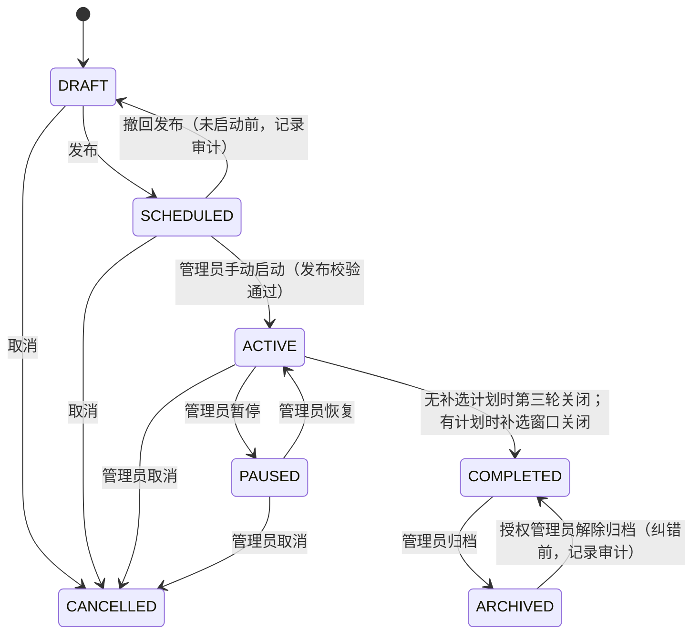
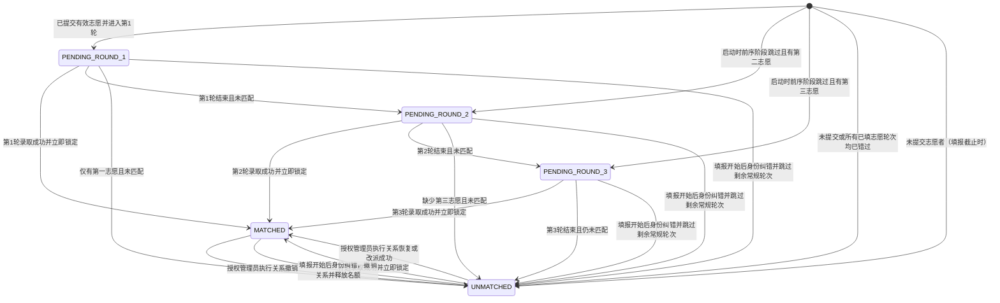
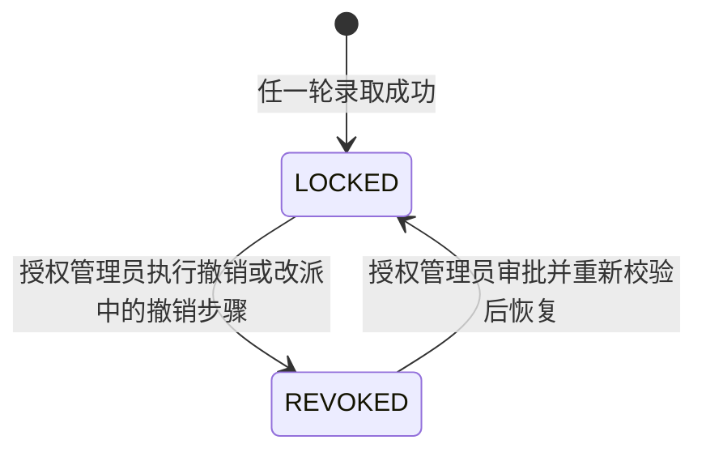

# 状态机设计

> 版本：0.14（常规关系恢复与改派边界）
> 状态：业务方确认按当前内容定案；TODO-49 特殊边界继续暂缓。
> 本文区分批次、轮次、学生志愿、学生匹配状态和锁定关系，避免用单一“申请状态”承载不同含义。登记表 `TODO-01` 至 `TODO-48`、`TODO-P01` 至 `TODO-P10`、`TODO-50` 至 `TODO-63`、`TODO-68` 已确认；此前 `TODO-64/66/67` 的名单授权决定已被 TODO-68 取代。`TODO-49` 的迟启动冻结、特殊身份纠错和缺少冻结依据的关系恢复/改派边界暂缓；`TODO-65` 记录师生凭证重置授权/API 缺口，不改变本文件状态转换规则。常规关系恢复/改派按第 7 节实施；补选关闭时自动完成批次（TODO-39）。

## 1. 状态对象

1. **批次状态**描述整场互选的生命周期。
2. **阶段/轮次状态**描述填报、第 1/2/3 轮及补选各自的开放进度。
3. **学生志愿状态**描述有序志愿是否已提交、是否锁定。
4. **学生匹配状态**描述学生在某个批次中是否等待某一轮、已匹配或未匹配；状态按批次持有（「批次 + 学生」维度），不设跨批次的单一全局状态。
5. **导师对学生的本轮处理状态**描述逐项录取或不录取等当前轮动作。
6. **师生关系状态**描述录取成功后立即锁定的关系及受控的例外处理。

学生专业/学位类型、导师允许报考范围是资格属性与操作前置条件，不新增学生匹配状态。按批次设置导师范围，在填报开始时冻结；常规与补选申请/录取均须满足类型和专业（TODO-43 至 TODO-46）。

## 2. 批次状态

### 2.1 状态定义

| 状态 | 含义 |
|---|---|
| `DRAFT` 草稿 | 管理员配置批次，尚未对参与者开放 |
| `SCHEDULED` 已发布待开始 | 已发布，开始时间尚未到或尚未执行开始动作 |
| `ACTIVE` 进行中 | 管理员已手动启动；当前处于等待填报、志愿填报、常规轮次或补选阶段 |
| `PAUSED` 已暂停 | 管理员暂时阻止学生和导师办理；当前阶段计时停止，恢复后当前及所有未开始阶段整体平移相同暂停时长；已提交志愿、申请和已锁定关系保留 |
| `COMPLETED` 已完成 | 常规三轮均已关闭；若安排补选，则在补选窗口关闭时自动完成；不再接受学生/导师常规办理，但仍可执行授权管理员的审计关系纠错 |
| `ARCHIVED` 已归档 | 只读保存历史结果 |
| `CANCELLED` 已取消 | 管理员取消批次；停止后续流程并保留所有历史数据与操作记录。已生效并锁定的关系继续保留；待处理或处理中的申请转为 `CANCELLED_BY_BATCH`；不物理删除 |

### 2.2 转换

- `DRAFT → SCHEDULED` 需要批次规则和必需数据满足发布校验。管理员须在发布前选择是否安排补选；选择安排时，必须在发布前完成补选时间配置。补选窗口关闭即自动完成批次，窗口关闭后不得重开；时间调整须在关闭前完成（TODO-39）。

- `ACTIVE` 覆盖填报和多个处理阶段；当前所在阶段由独立阶段状态描述。

- 批次仅可由管理员手动启动；仅已发布且通过发布校验的 `SCHEDULED` 批次可启动。启动后批次变为 `ACTIVE`。启动时已错过的阶段视为已关闭、不补办，按当前时间落入的阶段进入；已错过全部阶段（含补选）则禁止启动，管理员须撤回发布（`SCHEDULED → DRAFT`）或取消批次。
- 若启动时跳过一个或多个志愿轮次，首个实际开放轮次为第 N 轮时，只处理仍未匹配且有已锁定第 N 志愿的学生；未来顺位仍在原轮次处理。此前被跳过的已填志愿结果记为 `SKIPPED_BY_SCHEDULE`，不得视为导师不录取。没有任何尚未错过的已填志愿者转为 `UNMATCHED`，原因记为 `ALL_REMAINING_PREFERENCES_SKIPPED`；仍有未来顺位志愿者继续等待相应轮次。填报窗口错过后不得补交或修改志愿；未提交者按 `NOT_SUBMITTED` 规则转为 `UNMATCHED`。若跳过填报阶段，仅已锁定志愿版本可参与之后仍开放的轮次。
- 同一学年、同一学院最多有一个处于 `SCHEDULED`、`ACTIVE` 或 `PAUSED` 的运行批次。`DRAFT`、`COMPLETED`、`ARCHIVED`、`CANCELLED` 不占用运行名额；首期不支持同年度并行运行批次，终态批次后可创建新的追加批次并记录原因。
- 撤回发布仅可在批次尚未启动前执行，用于重新配置阶段时间；操作记录操作者、时间与原因。
- 启动时若当前时间处于已配置的阶段窗口，直接进入该阶段；若早于志愿填报开始时间，批次保持 `ACTIVE`，阶段状态为 `WAITING_FILLING`。后续阶段按配置时间自动切换。

- 暂停时禁止学生和导师继续办理，当前阶段计时冻结；恢复后当前及所有未开始阶段的时间整体平移累计暂停时长。已提交志愿、申请和已锁定关系保留。

- 暂停后到达的新业务请求直接拒绝；暂停前已成功提交的事务继续有效，正在执行的操作以服务端事务最终提交结果为准。

- 取消后停止后续流程并保留历史数据和操作记录；不得物理删除。

- 批次取消后停止后续阶段并保留历史记录。已经生效并锁定的关系不自动撤销，关系继续保留并标注来源批次已取消；如确需撤销，按第 7 节的管理员关系例外处理规则执行。
- 批次取消时，所有仍处于待处理或处理中的常规轮次申请及补选申请统一转为 `CANCELLED_BY_BATCH`。
- 批次取消且申请转为 `CANCELLED_BY_BATCH` 后，尚未匹配学生的本批次匹配状态复用 `UNMATCHED`，不新增批次取消专用的匹配状态。
- 常规轮次按时关闭时，未处理申请按不录取处理；补选结束时仍未匹配者保持 `UNMATCHED`。
- 补选仅按发布前配置的计划开放；管理员只能在窗口关闭前调整安排，达到结束时间后补选关闭，之后不得重开。
- 未安排补选的批次在第三轮关闭后进入 `COMPLETED`。安排补选的批次依发布时计划进入补选阶段；窗口关闭时仍待处理申请按不录取结案（`REJECTED`），学生保持 `UNMATCHED`，同时批次自动进入 `COMPLETED`（TODO-07/39）。

## 3. 阶段与轮次状态

### 3.1 常规阶段

填报期和三轮处理期属于同一批次的不同阶段。建议每个阶段独立记录 `NOT_STARTED`、`WAITING_FILLING`、`OPEN`、`CLOSED`，处理中的轮次还可显示 `PROCESSING`。阶段按管理员设定的时间自动切换；这些状态名是设计用语，最终命名可在后续技术设计统一。批次已启动但尚未进入填报窗口时，填报阶段状态为 WAITING_FILLING。

| 阶段 | 可开放的前置条件 | 处理范围 | 关闭后的作用 |
|---|---|---|---|
| 志愿填报 | 批次已发布且在填报窗口 | 学生提交 1–3 个有序志愿 | 志愿按确认规则锁定，生成第 1 轮候选 |
| 第 1 轮 | 志愿截止，批次未暂停 | 只处理第一志愿且未匹配的学生 | 未匹配者进入第二志愿轮次 |
| 第 2 轮 | 第 1 轮关闭 | 只处理第二志愿且仍未匹配的学生 | 未匹配者进入第三志愿轮次 |
| 第 3 轮 | 第 2 轮关闭 | 只处理第三志愿且仍未匹配的学生 | 尚未匹配者变为 `UNMATCHED` |
| 补选 | 发布前已选择安排并配置起止时间；按计划开放，关闭后不得重开 | 仅 `UNMATCHED` 学生可参加；导师须有剩余名额且经管理员允许参与 | 关闭时待处理申请结案，未匹配者保持 `UNMATCHED`，批次自动进入 `COMPLETED`（TODO-39） |

启动时前序阶段可能因时间已过而跳过；此时阶段表中的“上一阶段关闭”可由“上一阶段按启动规则标记为已跳过”满足。跳过规则见第 3.1 节。轮次仍只读取自身志愿顺位，不把较高顺位志愿改作当前轮申请。

填报、常规轮次和补选窗口均采用左闭右开区间 `[startAt,endAt)`。写操作先锁定阶段记录，再读取数据库 UTC 时间校验；客户端时间不参与，恰好等于 `endAt` 时拒绝。事务内校验已在截止前通过的操作，即使事务稍后提交仍有效。异步批量操作逐项按各自事务的校验时刻判断，接收批量请求不等同于项目已及时办理（TODO-50）。

轮次严格按 1 → 2 → 3 顺序处理；不因学生少填志愿而跳用其他顺位。管理员设置轮次时间，系统自动切换。暂停期间当前阶段剩余时间冻结；恢复后当前及所有未开始阶段的时间整体平移相同暂停时长（整体顺延）。启动时已错过的阶段视为已关闭、不补办。某轮无待处理申请时仍等待至设定截止时间，不提前关闭。

### 3.2 轮次内部处理

建议展示状态：`NOT_STARTED` → `OPEN` → `PROCESSING` → `CLOSED`。导师逐项选择录取或不录取，不进行排序；可以不单独展示 `PROCESSING`，但审计中仍应记录每项处理动作。

- 只有当前轮对应的志愿进入本轮队列。
- 导师录取时服务端原子校验剩余名额、学生尚未匹配及学位类型/专业均符合本批次冻结的导师范围。
- 多个独立批量操作竞争名额时不提供全局 FIFO 或公平顺序；名额行锁保证不超额，先获得名额行锁并成功提交的一方取得最后名额（TODO-51）。
- 学生一旦匹配，立即从尚未完成的轮次队列移除。
- 管理员配置各轮时间，系统按配置自动切换轮次。
- 轮次关闭时，未处理申请统一按不录取处理。

## 4. 学生志愿状态

| 状态 | 含义 |
|---|---|
| `NOT_SUBMITTED` | 尚未提交本批次志愿 |
| `SUBMITTED` | 已提交至少一个、最多三个不同导师的有序志愿，当前仍按业务规则办理 |
| `LOCKED` | 到达志愿锁定条件，三项或已填项目不可再改 |
| `WITHDRAWN` | 学生撤回本次志愿；填报截止前允许撤回并重新提交 |

建议转移：`NOT_SUBMITTED → SUBMITTED → LOCKED`。填报截止前，学生可以修改或撤回；截止时未撤回的志愿锁定。撤回后可在截止前重新提交；每次提交生成新版本，历史版本只增不删，截止时以最后提交版本锁定。志愿锁定后，后续匹配按原序号读取，不对志愿重排。

提交新版本前，学生须确认本批次当前专业/学位类型信息无误；确认记录绑定学生当前身份分类版本。管理员更正身份后旧确认失效，学生须核对新资料并重新确认。各项导师必须允许该学生的学位类型与专业；任一项不符即拒绝本次完整提交，不生成部分有效版本，也不因此把学生改为 `UNMATCHED`。补选提交及 `IN_REVIEW → ADMITTED` 同样须通过范围校验。填报开始后身份纠错按 TODO-48 将学生置为 `UNMATCHED`，关闭其尚未办理的常规志愿，并直接等待补选；如果已有锁定关系，先撤销关系并释放名额。历史记录保留，不将纠错记为导师不录取。

## 5. 学生匹配状态

### 5.1 状态定义

| 状态 | 含义 |
|---|---|
| `PENDING_ROUND_1` | 等待第 1 轮处理第一志愿 |
| `PENDING_ROUND_2` | 第 1 轮未匹配或按启动规则跳过，等待第二志愿处理 |
| `PENDING_ROUND_3` | 前两轮未匹配或按启动规则跳过，等待第三志愿处理 |
| `MATCHED` | 任一轮录取成功；关系立即锁定，退出普通后续轮次 |
| `UNMATCHED` | 第 3 轮结束后仍未匹配；未提交志愿者在填报截止时标记为该状态；少于三项志愿者在最后一个已填志愿轮结束后仍未匹配时标记，原因是 `PREFERENCE_EXHAUSTED` 并记录实际末轮/顺位；启动时所有已填志愿轮均已错过、管理员撤销关系或填报开始后进行身份纠错时也可转为该状态，来源须分别留存 |

未提交志愿者的志愿状态记为 `NOT_SUBMITTED`，不进入第 1 轮候选；其匹配状态在填报截止时直接标为 `UNMATCHED`，并可参加补选（符合其他补选条件时）。

如启动时跳过前序轮次，学生的初始匹配状态直接设为最早一个尚未错过且存在已锁定志愿的轮次（`PENDING_ROUND_1/2/3`）。所有已填志愿轮次都已错过的学生转为 `UNMATCHED`，来源为 `ALL_REMAINING_PREFERENCES_SKIPPED`；未提交者仍使用 `NOT_SUBMITTED` 来源。该场景不伪造前序轮次申请或导师决定。

### 5.2 正常状态转移

常规轮次或补选录取成功后转换为 `MATCHED`，不再进入后续常规轮次。少填志愿者在最后一个已填顺位轮结束后转为 `UNMATCHED`，原因是 `PREFERENCE_EXHAUSTED`；补选拒绝不会改变 `UNMATCHED` 状态。轮次重开仅将因系统自动结案而推进的学生状态恢复为轮次处理前状态，并追加审计历史；不得回滚导师决定。管理员关系纠错的状态转移见第 7 节。

### 5.3 缺少后续志愿的情况

没有第二或第三志愿的学生不生成该轮导师申请，不复制其他志愿。该学生在其最后一个已填志愿对应轮次结束时仍未匹配的，即置为 `UNMATCHED`，原因记为 `PREFERENCE_EXHAUSTED` 并保留实际末轮/顺位。该类计入正常志愿流程未匹配，可按耗尽轮次细分。无论展示时点如何，三轮常规流程结束后所有仍未匹配者均须为 `UNMATCHED`。

## 6. 本轮申请处理状态

为保留导师逐轮操作历史，每个学生志愿与轮次的处理结果应与学生本批次匹配状态分开表达。以下是建议业务标签，不预先规定数据库实现：

- `WAITING`：该志愿的处理轮尚未到达。
- `IN_REVIEW`：已进入对应轮，导师尚未完成处理。
- `ADMITTED`：导师在本轮录取，且学生本批次状态已转为 `MATCHED`。
- `NOT_ADMITTED`：本轮完成后未录取。
- `SKIPPED_BY_SCHEDULE`：该志愿对应的轮次在批次启动时已错过并关闭；不是导师不录取，不计入导师拒绝统计。
- `SKIPPED_MATCHED`：学生此前已匹配，因此该后续志愿不再处理。
- `SKIPPED_IDENTITY_CORRECTION`：填报窗口开始后管理员纠正学生身份，该学生退出尚未办理的常规轮次；不是导师不录取，身份及相关处理记录保留。
- `NO_PREFERENCE`：学生未提交该顺位，不生成导师申请。
- `REJECTED`：补选申请被导师拒绝；学生仍为 `UNMATCHED`，可在补选窗口内向其他符合条件的导师申请。
- `CANCELLED_BY_BATCH`：批次取消时，尚待处理或处理中申请的结案状态；常规轮次和补选申请均适用。
- `SUPERSEDED_BY_REOPEN`：仅记录因轮次重开而失效的下游等待申请；保留旧记录，不进入当前处理队列。

常规轮次关闭时，尚未处理的 `IN_REVIEW` 申请由系统自动结案为 `NOT_ADMITTED`，结案来源须与导师明确不录取、批量操作名额不足区分。符合 TODO-38 条件的重开命令须提交 `newEndAt` 和原因；目标轮次重新进入 `OPEN` 并增加处理周期，系统自动结案记录保留，恢复范围内的申请重新进入 `IN_REVIEW` 并生成新资料快照。仅本轮自动结案导致的学生状态恢复为本轮等待；下游无人处理的等待申请标记 `SUPERSEDED_BY_REOPEN`，阶段周期增加，之后开放时复用该申请记录并建立新处理周期。目标轮次的开始时间为重开时刻，截止时间为管理员指定的 `newEndAt`；后续阶段依截止时间差重排，恢复批次时只顺延重开后的暂停时长。导师决定、名额不足结案、关系和其他学生状态不回滚。批量录取按确定性顺序执行：常规轮次先按该顺位志愿最终锁定版本的提交时间升序、同一时间按学号升序，补选按该条补选申请的提交时间升序、同一时间按学号升序，依次录取至名额用尽；因名额不足未录取的余项结案为 `NOT_ADMITTED`，并返回逐项明细。轮次进行中不向学生公布导师的录取或不录取结论，学生仅可见「待处理／已处理」，轮次关闭后统一公布该轮结果。补选同一时刻最多有一条待处理申请；补选拒绝后可申请其他符合条件的导师。补选成功后生成最终 `MatchingResult`。

## 7. 师生关系状态

- 常规路径：不存在关系 → 导师录取通过服务端校验 → 关系立即 `LOCKED`、学生立即 `MATCHED`、导师剩余名额减一。

- `LOCKED` 表示本批次内不再参加后续常规轮次；任何纠错不能静默覆盖原记录。

- 已锁定关系原则上不由普通管理员或导师直接修改。确需撤销、恢复或改派时，由在相应组织范围内具备关系管理业务权限的管理员处理并留痕。
- 批次 `COMPLETED` 后仍允许上述授权关系纠错，但不恢复常规录取、志愿修改或补选办理；关系纠错不得隐式重跑轮次。`ARCHIVED` 批次只读，纠错前须由有权限的管理员执行 `ARCHIVED → COMPLETED` 解除归档操作并留审计，纠错完成后可再次归档。
- 完成/解除归档后的关系纠错仍须原子更新关系状态、导师名额和统计；操作人必须具备对应关系管理权限及学院数据范围，总管理员按 TODO-56 拥有全系统管理员业务范围，但仍须具备对应业务能力并遵守状态、名额和审计校验。
- 撤销：关系由 `LOCKED` 变为 `REVOKED`，学生恢复为 `UNMATCHED`，原导师名额回退 1 个；保留原关系记录，不得删除。
- 恢复：仅可将原 `REVOKED` 关系恢复为 `LOCKED`，且学生当前必须因 `RELATION_REVOKED` 处于 `UNMATCHED`；身份纠错导致的未匹配不能恢复。操作前重新校验学年关系唯一性及原导师剩余名额；成功后学生变为 `MATCHED`，重新占用原导师名额。
- 改派：不得覆盖原关系。仅对学生当前持有的 `LOCKED` 关系办理；新导师必须存在本批次已冻结且适用于学生当前专业、学位类型的可报范围，并有剩余名额。先撤销原关系并回退原导师名额，再创建指向新导师的 `LOCKED` 关系、更新学年关系槽和学生当前关系指针。旧/新名额行按确定顺序锁定，整个改派作为一个事务完成。
- 撤销、恢复和改派均记录操作类型、学生、原导师、新导师（如有）、原因、审批意见、操作时间和操作人。操作完成后通知学生和原导师；改派时也通知新导师。
- 补选成功后沿用 `LOCKED` 关系状态和本批次剩余名额规则。

## 8. 轮次边界条件

- 当前轮开始时读取对应志愿顺位；严禁先处理第二/第三志愿。
- 同一轮的导师录取操作可能并发，名额校验与锁定必须作为一个不可分割业务操作。
- 两个操作同时尝试匹配同一学生时，只允许一个成功；另一个应返回“学生已匹配/状态已变化”。
- 名额为零时不得成功录取。
- 当前轮关闭后不得继续普通录取。管理员仅可在本轮关闭前延期，须设置新的截止时间；本轮处理权限持续至新截止时间，后续轮次相应顺延。延期不影响已提交申请、已完成录取或已锁定关系。系统记录延期前后截止时间、操作人、操作时间和原因。
- 轮次正式关闭后不得直接延期；如需重新开放，须使用独立的“重新开放轮次”操作，仅可由管理员执行，且须满足：批次已暂停，且下一轮尚未产生任何处理动作（已录入的录取／不录取结论不可回滚，此时不得重开）。重开时同步重算后续阶段时间；重开不影响已锁定关系与已完成录取，该轮未处理申请重新进入 `IN_REVIEW`，并记录审计。

## 9. 补选完成规则

`TODO-39` 选择方案 B：补选窗口关闭时批次自动进入 `COMPLETED`，并按 TODO-07 取消关闭后的重开操作；补选时间或安排只能在窗口关闭前调整。批次完成后仍可依 TODO-35 执行授权关系纠错，但不能恢复学生/导师办理或补选窗口。该规则已同步至 [业务规则](business-rules.md) 和 [逻辑数据模型](logical-data-model.md)。

## 10. 可报范围冻结与待确认边界

填报窗口开启时，与资格名单冻结分别记录本批次每位导师的有效可报范围版本。冻结后，常规轮次、重开以及补选均沿用该版本；暂停、延期、撤回学生志愿不解冻导师范围。导师不能在补选阶段放宽专业/学位条件（TODO-44/46）。

专业目录由管理员维护；导师自行配置且不经管理员审核。配置不完整时采用全勾选默认范围，即学硕、专硕及全部专业；填报开始后锁定。若启动跳过填报阶段，冻结时点如何处理列入 TODO-49；专业代码及有效期间的具体数据表达在物理数据字典阶段明确。

学生在志愿填报前核对身份资料，有误先向管理员申请修改。填报窗口开始后发现身份错误，经管理员修改后，该学生本批次匹配状态转为 `UNMATCHED`，不再参加尚未办理的常规轮次，等待补选。如果已经 `MATCHED`，先撤销锁定关系、释放名额，再转为 `UNMATCHED`。志愿/申请历史不删除、不把该事件记作导师不录取；身份纠错来源为 `IDENTITY_CORRECTION`。这是管理员执行的关系例外，保留原因及前后资料/关系/名额审计。

启动时跳过填报阶段的范围冻结，以及补选不存在/已关闭/批次已完成时办理身份纠错，继续按 TODO-49 暂缓。常规关系恢复/改派仅在批次标准流程已有可验证冻结范围时办理；缺少冻结范围、或关系撤销源于身份纠错的请求返回 `BUSINESS_RULE_DEFERRED`。这不扩展到上述 TODO-49 边界，也不改变已确认的补选关闭规则。
